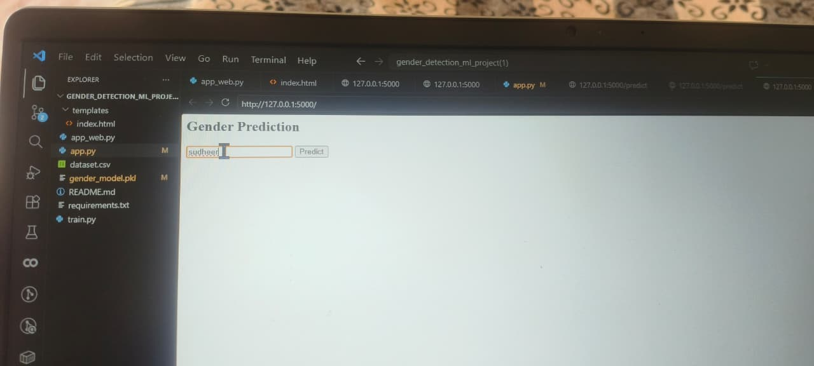
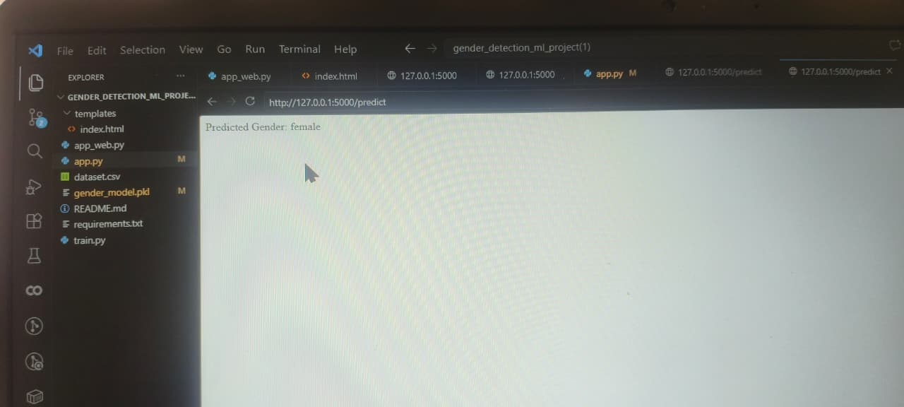
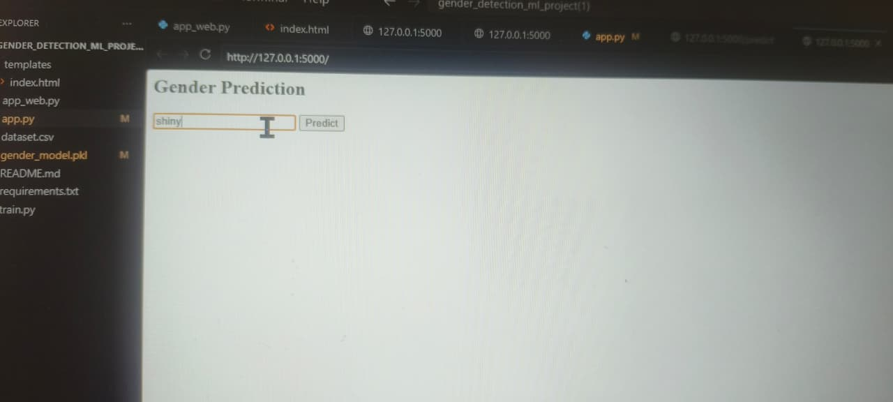
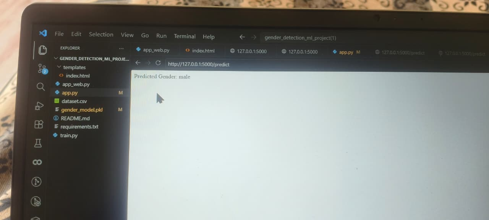

# Gender Detection using Machine Learning

Project Structure

gender_detection_ml_project/
├── dataset.csv
├── train.py
├── app.py
├── requirements.txt
└── README.md

Steps:
1. pip install -r requirements.txt
2. python train.py
3. python app.py
# Gender Detection ML Project

## Output Screenshots

### Male Prediction

### Female Prediction

### Prediction for Sudheer

### Web Application
